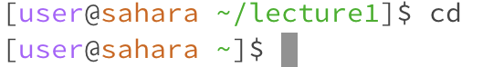

# Lab Report 1

1. Share an example of using the command with no arguments.

3. Share an example of using the command with a path to a directory as an argument.

5. Share an example of using the command with a path to a file as an argument.

