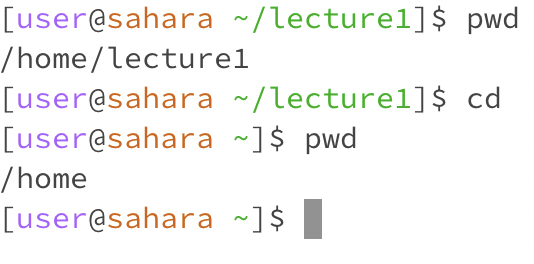
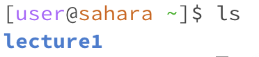
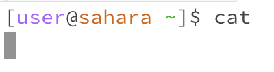
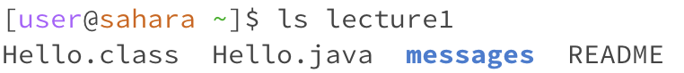
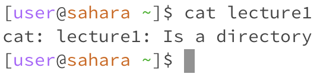
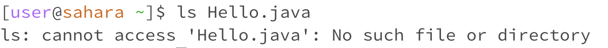
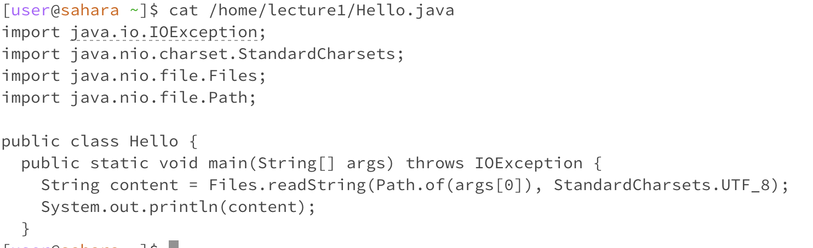

# Lab Report 1

## 1. Share an example of using the command with no arguments.  

a)`cd`  

  
The working directory was /home before and after the command was run because it ran with no arguments and so there were no new directories it stayed in the same one. The output was not an error.  
  
Meanwhile, if the working directory starts with /home/lecture1, using cd command will cause the directory to change back to /home. The output was not an error.

  b)`ls`  
  
  
Similar to the previous example, /home is the working directory after running the command ls, the output is all the available directories inside in /home, in this case, it is only lecture1. The output was not an error.  

  c)`cat`  

  
This command does not output anything apparent, the working directory was /home and remained the same. There was nothing in the filesystem so cat was a useless command in this case. The output did not generate an error message, because it was reading the files but did not display anything.  

---  

## 2. Share an example of using the command with a path to a directory as an argument.  

   a)`cd`  
   
   
  

Running cd lecture1 will change the current directory from /home to /home/lecture1. The output is only a change in the directory and now you can access things within that new directory. The output was not an error.  

  b)`ls`  
  
   
  

Running ls lecture1 shows us files inside of /home/lecture1. The current directory is /home/lecture1 since we specified it as an argument. The output is not an error.  

  c)`cat`  
    
  
This output is an error because we're trying to use the cat to show the contents of a directory (lecture1), rather than a file. cat can only have a file as an argument and cannot have a directory as an argument, so it outputs an error. The working directory was /home, and did not change.   

---  

## 3. Share an example of using the command with a path to a file as an argument.  

   a)`cd`  
   
   
  

cd is used on directories, so using a filename like Hello.java as an argument to cd, will result in a "directory not found" error since Hello.java is a file name and not a directory. Running cd Hello.java does not change the directory if it is /home/lecture1 or /home, in this case the current working directory was /home/lecture1. The output is an error since Hello.java is not a directory that cd can go to.  

  b)`ls`  
  
  

Running ls Hello.java does not change the directory /home. Output is an error because ls is used to list or view files in a directory, and not to display information about a file.  

  c)`cat`  
  
    
  
  
The current working directory starts with /home, and then running cat Hello.java changes the directory to /home/lecture1/Hello.java to display the code of Hello.java. You must specify what the path is before that, by running cat with the absolute path /home/lecture1/Hello.java. The output does not produce an error.  
