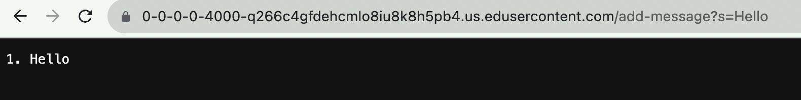
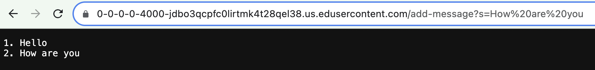
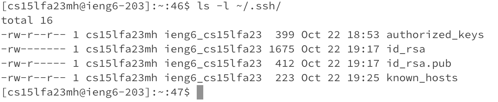
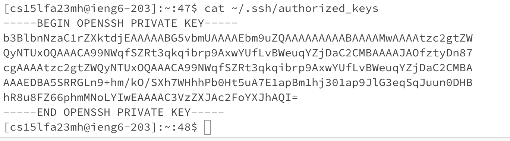
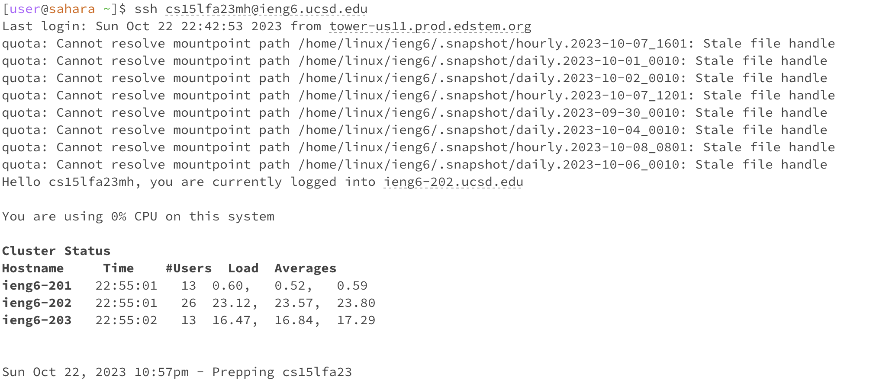

# Lab Report 2  
---

## Part 1  
My implementation of StringServer.java
```
import java.io.IOException;
import java.net.URI;
import java.net.URLDecoder;
import java.io.UnsupportedEncodingException;

class Handler implements URLHandler {
    int num = 1;
    String currentStr = "";

    public String handleRequest(URI url) {
        if (url.getPath().contains("/add-message")) {
            String query = url.getQuery();
            if (query != null) {
                String[] param = query.split("=");
                if (param[0].equals("s")) {
                    try{
                        String decoded = URLDecoder.decode(param[1], "UTF-8");
                        decoded = decoded.replace("+", " ");
                        currentStr += num + ". " + decoded + "\n";
                        num++;
                        return currentStr;
                    }
                    catch (UnsupportedEncodingException e) {
                        return "Error decoding the parameter: " + e.getMessage();
                    }
                    
                }
            }
        }
        return "404 Not Found!";
    }
}

public class StringServer {
    public static void main(String[] args) throws IOException {
        if (args.length == 0) {
            System.out.println("Missing port number! Try any number between 1024 to 49151");
            return;
        }

        int port = Integer.parseInt(args[0]);

        Server.start(port, new Handler());
    }
}
```

Using /add-message  

  
For both /add-message requests, the main method is called to execute StringServer, and the handleRequest method is called to handle each "request". The relevant method argument for both /add-message requests is url: a URL object that represents our given URL that contains a query s=Hello or s=How are you. query is a String variable in handleRequest that represents the received query of the URL, and param is a String array variable. currentStr will be changed in both /add-message requests.  

  
*As seen here, currentStr is changed to "1. Hello" after it is appended with num.*  

  
*As seen here, currentStr is changed to "1. Hello *next line* 2. How are you" after it is also appended with num.*  

  

---  
## Part 2  
The path to the private key for your SSH key  
  
The path to the public key for your SSH key  
  
A terminal interaction where you log into ieng6 with your course-specific account without being asked for a password  
  
---  
## Part 3  
In Week 3's lab, I learned how to configure the SSH public and private keys. Rather than having to input my password when prompted for a login, the SSH keys I generated enabled a password-free login process. This ultimately enhances efficiency and convenience when it comes to accessing my server.
